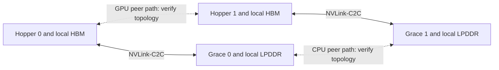

# Hardware feasibility and tools

Last researched: 2026-09-15

## Four questions, in order

1. **Capacity:** can weights, live state, and execution buffers be placed on actual devices?
2. **Compatibility:** can the selected engine/kernel execute this architecture and exact numerical format on this hardware?
3. **Performance:** which resource limits the target workload, and what bound or measurement supports that?
4. **Operations:** can we reproduce, monitor, recover, and afford this design under its SLO?

Passing capacity alone answers only the first question, conditionally. A hardware comparison always names the SKU, device count, host, topology, and workload.

## Reference specifications

**VERIFIED FACT:** advertised capacities and peak local memory bandwidth below. They are not measured sustained bandwidth or guaranteed allocatable capacity. GB/GiB conventions in vendor labels should be checked against runtime inventory; the first study explicitly uses a decimal-budget assumption.

| Reference platform | Advertised memory per device | Peak local memory bandwidth | Main lesson |
|---|---:|---:|---|
| RTX 5090 | 32 GB GDDR7 | 1,792 GB/s | Capacity constraints and consumer-GPU backend differences |
| H100 SXM | 80 GB HBM3 | 3.35 TB/s | Hopper baseline; do not substitute PCIe specifications |
| H200 SXM | 141 GB HBM3e | 4.8 TB/s | Greater capacity/bandwidth within the same broad architecture family |
| GH200 HBM3e variant | Up to 144 GB HBM3e, plus Grace LPDDR5X | Up to 4.9 TB/s HBM | Host/GPU locality and heterogeneous placement |
| B200 SXM in the cited HGX configuration | 180 GB HBM3e | Up to 8 TB/s | Blackwell format/backend and interconnect differences |
| AMD MI300X | 192 GB HBM3 | 5.3 TB/s | Capacity advantage must be paired with ROCm/kernel compatibility |

Primary sources: [RTX 5090 specifications](https://www.nvidia.com/en-sg/geforce/graphics-cards/50-series/rtx-5090/), [NVIDIA HGX reference architecture](https://docs.nvidia.com/enterprise-reference-architectures/hgx-ai-factory-h100-h200-b200/latest/components.html), [GH200 NVL2 reference discussion](https://developer.nvidia.com/blog/simplify-system-memory-management-with-the-latest-nvidia-gh200-nvl2-enterprise-ra/), [AMD MI300X](https://www.amd.com/en/products/accelerators/instinct/mi300/mi300x.html).

These are useful reference points, not an exhaustive current procurement list. Track newer accelerators when they change a decision; do not choose rental or purchase hardware from this table alone.

## GH200: draw the memory path

Conceptual diagram, not a verified inventory of your former machine. Local HBM, local Grace reads, cross-device transfers, and remote NUMA accesses are different paths.

NVIDIA describes up to 900 GB/s **bidirectional** NVLink-C2C and up to 480 GB LPDDR per Grace Hopper superchip. Do not use the bidirectional total as a one-way streaming rate, or treat it as DRAM bandwidth. The benchmark guide distinguishes Grace memory configurations and their bandwidths. [GH200 reference](https://developer.nvidia.com/blog/simplify-system-memory-management-with-the-latest-nvidia-gh200-nvl2-enterprise-ra/), [benchmark guide](https://docs.nvidia.com/gh200-superchip-benchmark-guide.pdf).

Your reported ~958 GiB Grace memory is historical user-provided inventory. It has not been reconciled with the cited reference SKU, units, reserved memory, or firmware. Preserve that distinction until an actual inventory is available.

Unified virtual addressing or coherent access does not make HBM and host memory equally fast. Ask whether the runtime performs explicit copies, device reads of host-resident tensors, page migration, or CPU computation. These have different bottlenecks.

## Beyond NVIDIA

For AMD, pair hardware specifications with the exact ROCm, engine, and kernel support. For CPU-only systems, memory-channel population, NUMA, vector/matrix instructions, quantization kernels, and actual sustained bandwidth matter. For unified-memory machines, reserve memory for the OS and other users of the shared pool. No Mac specification or local model capability has been inferred here.

For all platforms, record format support at the **kernel** level: stored bits, unpack/dequantization, matrix-operation dtype, accumulator dtype, and KV dtype. A low-bit checkpoint is not proof that every operation runs at that precision.

## Tools we can use

| Tool/approach | What it tells us | What it cannot establish | Current use |
|---|---|---|---|
| Hub configs and tensor indices | Architecture dimensions, revisions, stored tensor sizes | Runtime peak, speed, or quality | Used for the four pinned snapshots |
| Accelerate `estimate-memory` | Empty-weight model-size estimates for supported architectures | Complete inference memory or serving SLO | Optional cross-check; not installed |
| Python standard-library calculations | Explicit budgets, sensitivity analysis, bounds | Unmodeled runtime effects | Used for arithmetic; reproducible first-session recipe |
| Vidur | Serving-system simulations using its supported models and performance profiles | Uncalibrated predictions for arbitrary frontier models/hardware | Candidate for later scheduling study |
| AIPerf / vLLM benchmarks | Real serving behavior under specified load | GPU internals without telemetry/profiling | Planned after endpoint access |
| Engine source and existing tests | Actual allocation/scheduling logic at a revision | Runtime performance without execution | Three vLLM files inspected and pinned |

Tool evidence: [Accelerate estimator and limitations](https://huggingface.co/docs/accelerate/usage_guides/model_size_estimator), [Vidur repository](https://github.com/microsoft/vidur), [Vidur paper](https://www.microsoft.com/en-us/research/publication/vidur-a-large-scale-simulation-framework-for-llm-inference/), [AIPerf documentation](https://docs.nvidia.com/aiperf/welcome-to-ai-perf-documentation).

No dedicated Deep Research tool is exposed in this session. Research used multiple primary-source searches, official documents, a technical report, pinned configuration/index files, and source inspection. No simulator was run and no provider was provisioned.

## When access exists

Collect actual usable accelerator memory, device capability, driver/runtime versions, clocks/power limits, CPU architecture, RAM bytes, NUMA layout, peer links, storage, and host/device bandwidth. Select a compatible stack and a small correctness workload before a full benchmark. For remote APIs, establish which hardware/backend details are visible; client timings alone cannot identify a GPU bottleneck.
